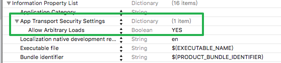

<?xml version="1.0" encoding="UTF-8" standalone="no"?>
<!DOCTYPE html PUBLIC "-//W3C//DTD XHTML 1.0 Transitional//EN" "http://www.w3.org/TR/xhtml1/DTD/xhtml1-transitional.dtd">
<html><head><meta http-equiv="Content-Type" content="text/html; charset=UTF-8"/><meta name="exporter-version" content="Evernote Mac 6.0.8 (451398)"/><meta name="author" content="1357512134@qq.com"/><meta name="created" content="2016-04-03 07:18:58 +0000"/><meta name="source" content="desktop.mac"/><meta name="updated" content="2016-04-03 07:27:23 +0000"/><title>0330</title></head><body>

Xcode 7, 涉及到了访问http资源，测试时碰到如下报错：

App Transport Security has blocked a cleartext HTTP (http://) resource load since it is insecure. 

 

解决方法：

打开 工程主目录下info.plist

增加属性字典 App Transport Security Settings

在这个属性下增加节点 Allow Arbitrary Loads, value 为 YES

</body></html>